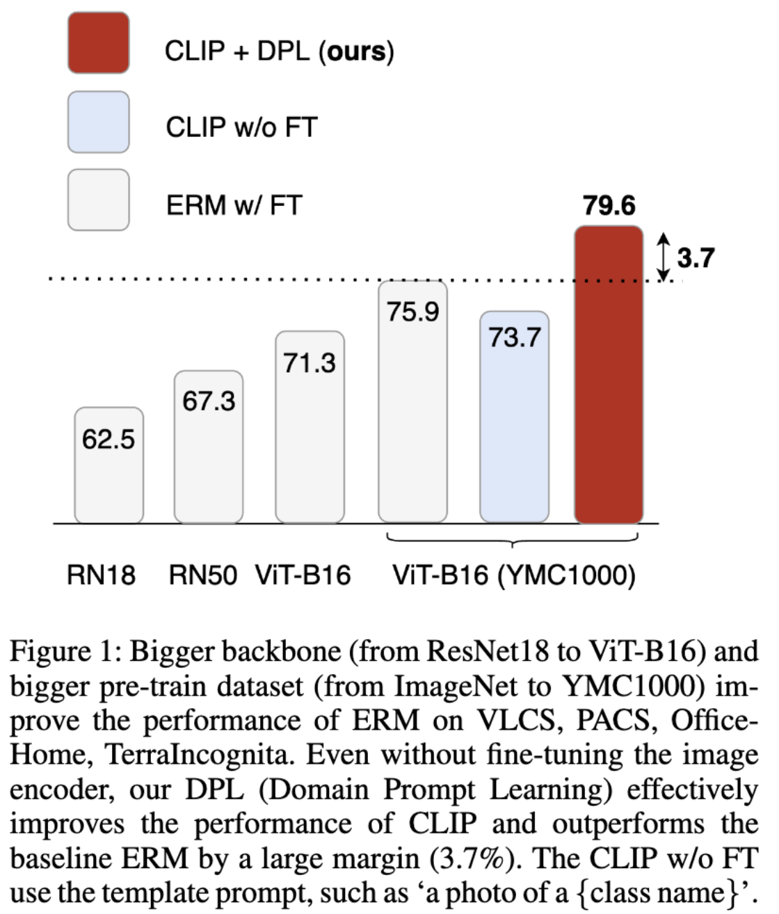
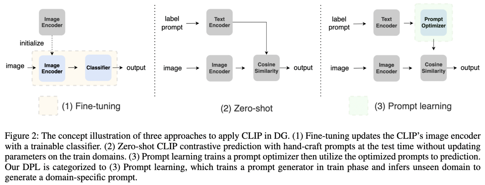
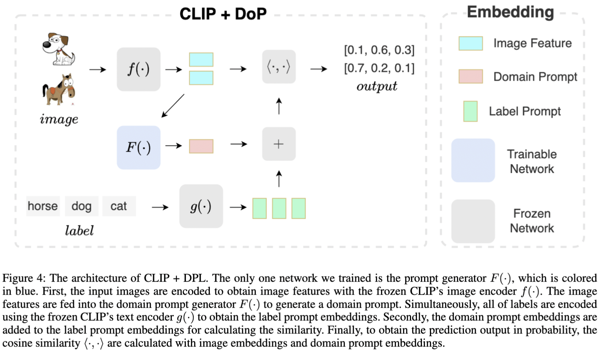
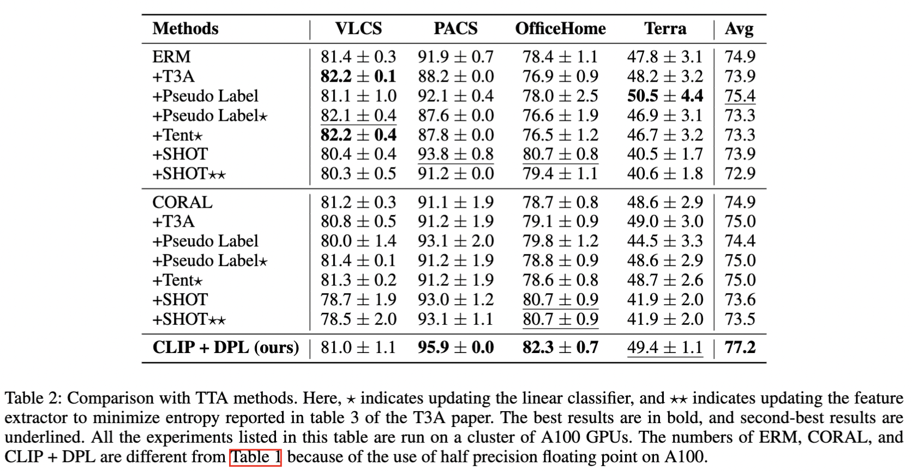
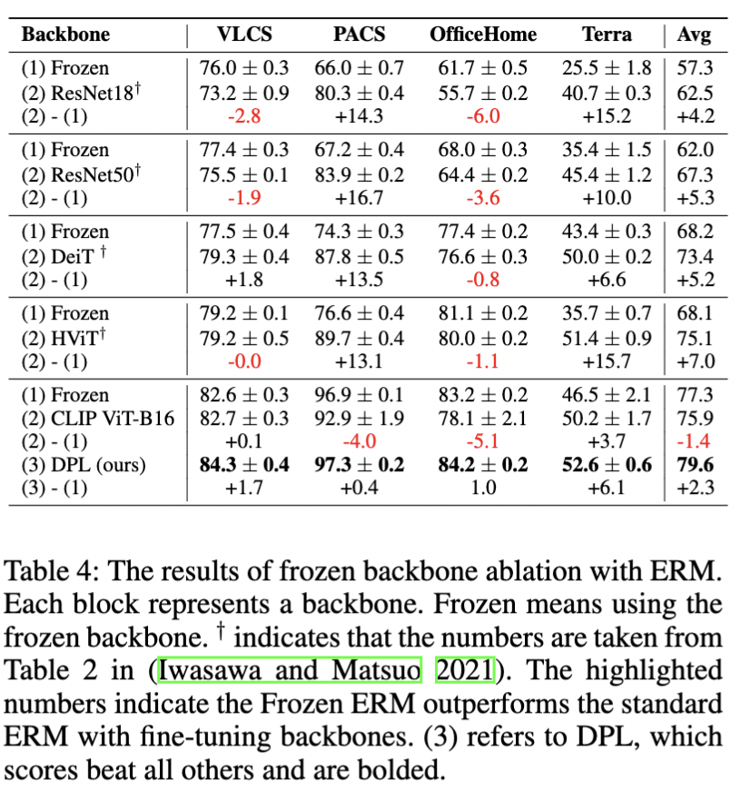

# Domain Prompt Learning for Efficiently Adapting CLIP to Unseen Domains

The official implementation of `Domain Prompt Learning for Efficiently Adapting CLIP to Unseen Domains`, based on [T3A](<https://openreview.net/forum?id=e_yvNqkJKAW&referrer=%5BAuthor%20Console%5D(%2Fgroup%3Fid%3DNeurIPS.cc%2F2021%2FConference%2FAuthors%23your-submissions)>). 
and [DomainBed](https://github.com/facebookresearch/DomainBed).

## <summary>Overview of Domain Prompt Learning</summary>










## Installation

<details><summary>0. Python libralies</summary><div>

```sh
python3 -m venv ~/venv/dplclip
source ~/venv/dplclip/bin/activate
pip install -r requirements.txt
```
</div></details>

<details><summary>1. Downlload the datasets</summary><div>

```sh
python -m domainbed.scripts.download --data_dir=/my/datasets/path --dataset pacs
```
Note: change `--dataset pacs` for downloading other datasets (e.g., `vlcs`, `office_home`, `terra_incognita`). 
</div></details>


<details><summary>2. DG & TTA experiment scripts.</summary><div>

```sh

python domainbed/scripts/sweep.py delete_incomplete --data_dir=/home/datasets --output_dir=/output_dir/sweep_hparam/DATASET --command_launcher multi_gpu --trial_seed TRIAL_SEED --algorithms ALGORITHM --datasets DATASET --test_envs TEST_ENV --n_hparams_from 0 --n_hparams 20 --skip_confirmation

    
python domainbed/scripts/sweep.py launch --data_dir=/home/datasets --output_dir=/output_dir/sweep_hparam/DATASET --command_launcher multi_gpu --trial_seed TRIAL_SEED --algorithms ALGORITHM --datasets DATASET --test_envs TEST_ENV --n_hparams_from 0 --n_hparams 20 --skip_confirmation
    
```


Note: change `--dataset DATASET --algorithms ALGORITHM --trial_seed TRIAL_SEED --test_envs TEST_ENV` for different experiments. 

(e.g., `python domainbed/scripts/sweep.py launch --data_dir=/home/datasets --output_dir=/output_dir/sweep_hparam/PACS --command_launcher multi_gpu --trial_seed 0 --algorithms DPLCLIP --datasets PACS --test_envs [0] --n_hparams_from 0 --n_hparams 4 --skip_confirmation`). 
</div></details>

## Main difference in DPLCLIP from the [T3A implementation](https://github.com/matsuolab/T3A).
1. The main code of algorithm is in `domainbed/algorithms.py`. 
2. The data transform of CLIP is implemented in `domainbed/datasets.py`. 
3. The scope of hyperparameters are defined in `domainbed/hparams_registry.py`. 
4. The implements of CLIP backbone for ERM, CORAL, and other methods are in `domainbed/networks.py`. 
5. The visualization of the results are in `domainbed/scripts/summarize_results.ipynb`, `domainbed/scripts/visualization_dlp_results.py`, `domainbed/scripts/visualization_tsne_datasets.py`. 


<details><summary>Implement CLIP in DomainBed</summary><div>

```python
class CLIP(Algorithm):
    def __init__(self, input_shape, num_classes, num_domains, hparams):
        super(CLIP, self).__init__(input_shape, num_classes, num_domains, hparams)
        self.hparams = hparams
        self.device = "cuda" if torch.cuda.is_available() else "cpu"
        
        self.clip_model = clip.load(self.hparams['clip_backbone'])[0].float()

        for param in self.clip_model.parameters():
            param.requires_grad = False
        
        print('Set self.clip_model.parameters.reguires_grad = False!')

        # embedding dim for image and text encoder.
        self.EMBEDDING_DIM = 512  # 
        
        classnames = [name.replace('_', ' ') for name in hparams['class_names']]
        self.prompt = torch.cat([clip.tokenize(f'a photo of a {ppt}') for ppt in classnames]).to(self.device)
        
    def update(self, minibatches, unlabeled=None):
        return {'loss': 0}
    
    def predict(self, x):
        logits_per_image, _ = self.clip_model(x, self.prompt)
        return logits_per_image.softmax(dim=-1)
```
</div></details>

<details><summary>Implement DPL for CLIP in DomainBed</summary><div>

```python
# rename to DPL (Domain Prompt Learning)
class DPLCLIP(CLIP):
    def __init__(self, input_shape, num_classes, num_domains, hparams, sentence_prompt=False):
        super(DPLCLIP, self).__init__(input_shape, num_classes, num_domains, hparams)

        #  initial prompt.
        prompt_prefix = ' '.join(['X'] * hparams['num_domain_tokens'])
        
        if sentence_prompt:
            print('Using sentence_prompt in DPLCLIP...')
            classnames = [f"a photo of a {name.replace('_', ' ')}" for name in hparams['class_names']]
        else:
            classnames = [name.replace('_', ' ') for name in hparams['class_names']]
        prompts = [prompt_prefix + ' ' + name + '.' for name in classnames]
        # prompts:  ['X X X X X X X X dog.', 'X X X X X X X X elephant.' ...]
        
        #  to get default token_prefix and token_suffix.
        self.tokenized_prompts = torch.cat([clip.tokenize(p) for p in prompts]).to(self.device)
        # tokenized_prompts[0] = tensor([49406,   343,   343,   343,   343,   343,   343,   343,   343,  1929, 269, 49407, 0, 0, ...])
        with torch.no_grad():
            embedding = self.clip_model.token_embedding(self.tokenized_prompts).type(self.clip_model.dtype)
        
        self.register_buffer('token_prefix', embedding[:, :1, :])  # SOS
        #  torch.Size([7, 1, 512])
        #  [-0.0001,  0.0002, -0.0046,  ...,  0.0010,  0.0025,  0.0049]
        
        self.register_buffer('token_suffix', embedding[:, hparams['num_domain_tokens'] + 1:, :])  # CLS, EOS
        # torch.Size([7, 68, self.EMBEDDING_DIM]), 68 := 77 - num_domain_tokens_tokens - 2.
        # [ 0.0013,  0.0046, -0.0115,  ...,  0.0112,  0.0147,  0.0040],...,.
        
        self.network = networks.MLP(self.EMBEDDING_DIM, self.EMBEDDING_DIM * hparams['num_domain_tokens'], hparams).to(device=self.device, dtype=self.clip_model.dtype)
        
        def init_weights(m):
            if isinstance(m, nn.Linear):
                torch.nn.init.xavier_uniform(m.weight)
                m.bias.data.fill_(0.01)
        
        self.network.apply(init_weights)
        
        self.optimizer = torch.optim.SGD(
            self.network.parameters(),
            lr=self.hparams["lr"],
            momentum=self.hparams["momentum"]
        )
            
    def update(self, minibatches, unlabeled=None):
        # minibatches = [[domain_1], [domain_2], [domain_3]]
        all_x = [data[0].cuda().float() for data in minibatches]
        all_y = torch.cat([data[1].cuda().long() for data in minibatches])

        #  encode image for each domain.
        image_features = [self.clip_model.encode_image(x) for x in all_x]
        
        #  extract domain_feature for each domain. [32, self.EMBEDDING_DIM] -> [32, self.EMBEDDING_DIM * num_domain_tokens] -> [self.EMBEDDING_DIM * num_domain_tokens].
        domain_features = [self.network(feature) for feature in image_features]
        image_features = torch.cat(image_features)
        #  reshape [self.batch_size, self.EMBEDDING_DIM.]:  -> [1, self.EMBEDDING_DIM.]
        mean_domain_features = [feature.mean(dim=0, keepdim=True) for feature in domain_features]

        #  reshape [1, self.EMBEDDING_DIM.]:  -> [7, self.EMBEDDING_DIM.]
        _mean_domain_features = [feature.repeat_interleave(len(self.hparams['class_names']), dim=0) for feature in mean_domain_features]
        
        #  generate text_feature from domain_feature. text_features.size = [3, 7, 512]
        # text_features = [self._get_text_features(feature) for feature in _mean_domain_features]
        text_features = torch.cat([self._get_text_features(feature) for feature in _mean_domain_features])
            
        image_features = image_features / image_features.norm(dim=-1, keepdim=True)
        text_features = text_features / text_features.norm(dim=-1, keepdim=True)
        logits_per_image = self.clip_model.logit_scale.exp() * image_features @ text_features.t()
        loss = F.cross_entropy(logits_per_image, all_y)
            
        self.optimizer.zero_grad()
        loss.backward()
        self.optimizer.step()
        return {"loss": loss.item()}


    def _get_text_features(self, domain_feature, coop=False):
        #  reshape domain_feature: [7, 16 * self.EMBEDDING_DIM] -> [7, 16, self.EMBEDDING_DIM]
        if coop:
            domain_feature = domain_feature.unsqueeze(0).expand(len(self.hparams['class_names']), -1, -1)
        domain_feature = domain_feature.reshape(-1, self.hparams['num_domain_tokens'], self.EMBEDDING_DIM)
        #  reshape domain_feature: [7, 16, self.EMBEDDING_DIM] -> [7, 77, self.EMBEDDING_DIM]
        domain_feature = torch.cat([self.token_prefix, domain_feature, self.token_suffix], dim=1)
        #  refer CoOp: CoOP github. https://github.com/KaiyangZhou/CoOp/blob/b0a058869cef00a4e4ea5256d40fd7681119c099/trainers/coop.py#L46
        x = domain_feature + self.clip_model.positional_embedding.type(self.clip_model.dtype)
        x = x.permute(1, 0, 2)
        x = self.clip_model.transformer(x)
        x = x.permute(1, 0, 2)
        x = self.clip_model.ln_final(x).type(self.clip_model.dtype)
        #  mapping domain_features to text_features.
        text_features = x[torch.arange(x.shape[0]), self.tokenized_prompts.argmax(dim=-1)] @ self.clip_model.text_projection      
        return text_features

    def predict(self, x):
        image_feature = self.clip_model.encode_image(x)
        
        domain_feature = self.network(image_feature)
        mean_domain_feature = torch.mean(domain_feature, dim=0, keepdim=True).repeat_interleave(len(self.hparams['class_names']), dim=0)
        text_feature = self._get_text_features(mean_domain_feature)
        
        image_feature = image_feature / image_feature.norm(dim=-1, keepdim=True)
        text_feature = text_feature / text_feature.norm(dim=-1, keepdim=True)
        return self.clip_model.logit_scale.exp() * image_feature @ text_feature.t()

```
</div></details>

## License

This source code is released under the MIT license, included [here](LICENSE).